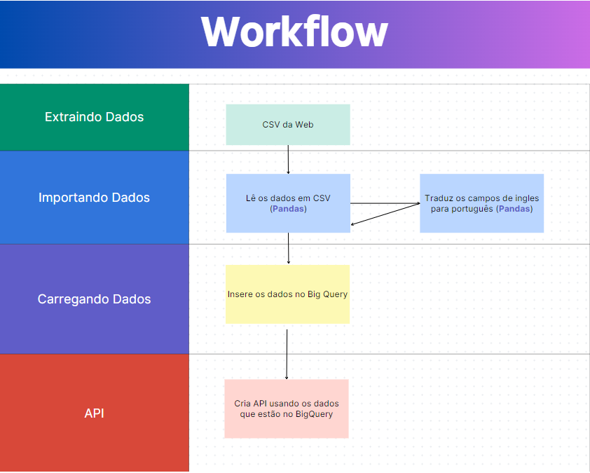

# CRIANDO API COM ETL 

**Este programa tem a função de ler qualquer dado de um csv da web, tratar os dados, carregar no BigQuery e deixar disponivel para qualquer pessoa acessar via API**

* ## Pré Requisitos
  1. *Ter uma conta no GCP, pode ser gratuita*
  2. *Criar uma service account para se conectar com o BigQuery*
  3. *Alterar na pasta doc a service account*

* ## Fluxograma

